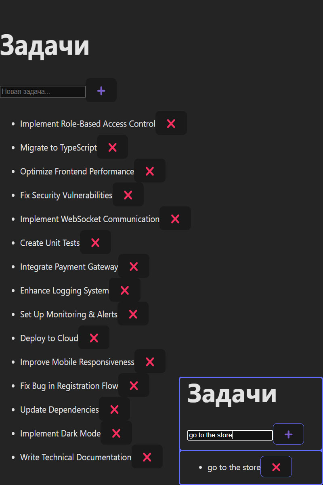

# 🧠 TaskFlow

TaskFlow is a modern task management application designed for simplicity, speed, and functionality. It features task CRUD operations, clean UI, and a dark-themed responsive layout — perfect for personal productivity.



---

## 🚀 Features

- ✅ Add, view, delete tasks
- 🗑️ Trash bin for soft deletes (future improvement)
- 🔁 Fast, dynamic updates
- 🎨 Minimalist dark UI with smooth UX

---

## 🛠 Tech Stack

### Frontend:
- React (with hooks)
- Axios (for API communication)
- CSS Modules / Dark theme
- Vite (bundler)

### Backend:
- Node.js + Express.js
- PostgreSQL + pg
- dotenv + CORS

---

## ⚙️ Installation

### 1. Clone repo

```bash
git clone https://github.com/DragonSnel/taskflow-backend
cd taskflow
```

### 2. Install backend

```bash
cd backend
npm install
npm run dev
```

### 3. Install frontend

```bash
cd ../frontend
npm install
npm start  # or npm run dev if using Vite
```

---

## 🌐 API Endpoints

| Method | Route           | Description               |
|--------|------------------|---------------------------|
| GET    | `/api/tasks`     | Get all tasks             |
| POST   | `/api/tasks`     | Create a new task         |
| PUT    | `/api/tasks/:id` | Update a task             |
| DELETE | `/api/tasks/:id` | Delete a task             |

---

## 📷 Interface Preview


---

## 🤝 Contributing

Pull requests are welcome. For major changes, please open an issue first.

---

## 📄 License

MIT

---

## 👤 Author

Made by [@DragonSnel](https://github.com/DragonSnel)
